<p align="center">
  
</p>

<h1 align="center">SamaySetu (समयसेतु)</h1>

<p align="center">
  <strong>Enterprise-Grade Institutional Timetable & Resource Allocation Engine</strong>
</p>

<p align="center">
  <a href="https://samaysetu.vercel.app">🌐 Live Preview</a> •
  <a href="#-system-architecture">📐 Architecture</a> •
  <a href="#-features">✨ Features</a> •
  <a href="#-tech-stack">🛠️ Tech Stack</a> •
  <a href="#-engineering-highlights">⚡ Engineering</a>
</p>

<p align="center">
  
  
  
  
  
  
  
</p>

---

> [!IMPORTANT]
> **Intellectual Property Notice — Patent Pending**
>
> The core scheduling algorithms, conflict-resolution engine, resource allocation logic, and database schema design of SamaySetu are protected under a pending patent application. The full production source code is maintained in a private repository. This public repository serves as an **architectural case study, system design reference, and feature showcase** to demonstrate engineering capabilities.

---

## 🎯 Overview

**SamaySetu** (Sanskrit: "Bridge of Time") is a production-grade academic timetable management platform designed for universities and colleges. It replaces error-prone manual scheduling with an intelligent allocation framework that coordinates thousands of variables — faculty workloads, course types (Lecture vs. Lab), room capacities, student divisions, batch strengths, and teacher availability preferences — while enforcing **zero allocation conflicts** through an 8-point real-time validation engine.

### 🔗 Live Preview

> **[https://samaysetu.vercel.app](https://samaysetu.vercel.app)**
>
> The live deployment showcases the frontend interface. For preview purposes, backend API services are hosted on Azure App Service, while the target production infrastructure is designed for AWS.

---

## 📸 Project Showcase (Screenshots)

To demonstrate the design and functionality of SamaySetu, here is a detailed visual tour of the platform's features:

### 🔑 1. Login Page
Secure authentication gateway for administrative users, coordinators, and faculty members with role-based routing.

<p align="center">
  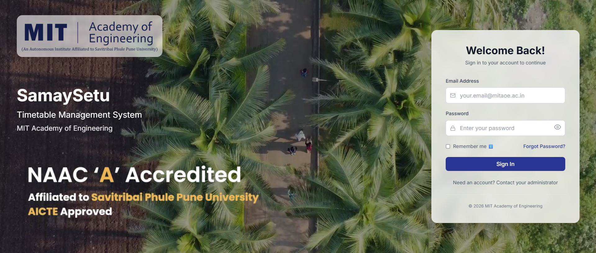
  <br/>
  <em>Figure 1: Secure gateway interface with JWT-based session authorization.</em>
</p>

---

### 📊 2. Analytics & Admin Dashboard
An overview dashboard displaying scheduling progress, room utilization rates, teacher workload statistics, and department analytics.

<p align="center">
  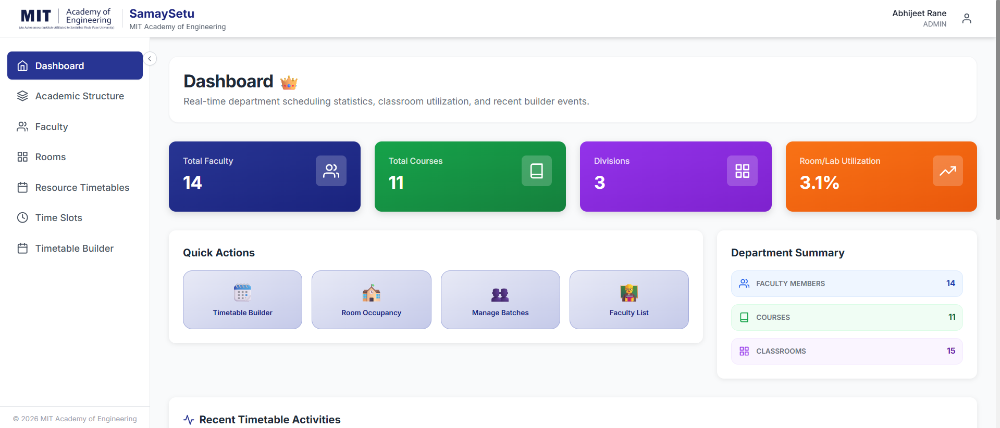
  <br/>
  <em>Figure 2: Main Admin Analytics Dashboard with real-time statistics on classroom utilization and scheduling progression.</em>
</p>

---

### 🗓️ 3. Interactive Timetable Builder
The core schedule editing interface featuring a drag-and-drop days-versus-slots grid, dynamic course allocations, and color-coded lecture/lab cards.

<p align="center">
  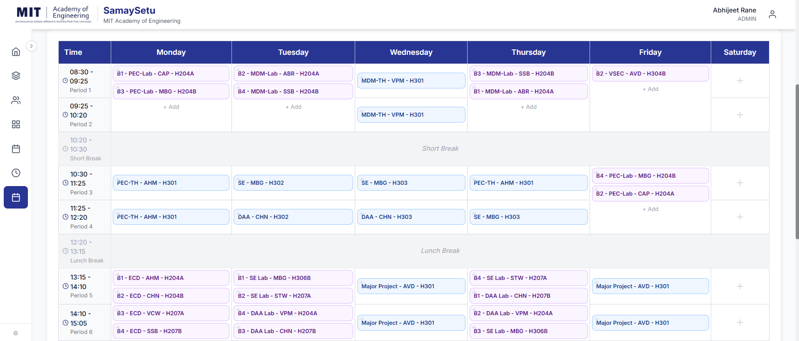
  <br/>
  <em>Figure 3: Custom timetable scheduling board showing interactive theory (blue) and laboratory (purple) allocations.</em>
</p>

---

### 🚨 4. Real-Time Conflict Resolution
Visual error feedback triggered by the 8-point conflict detection engine, detailing exactly where resources (teachers, rooms, divisions) are double-booked.

<p align="center">
  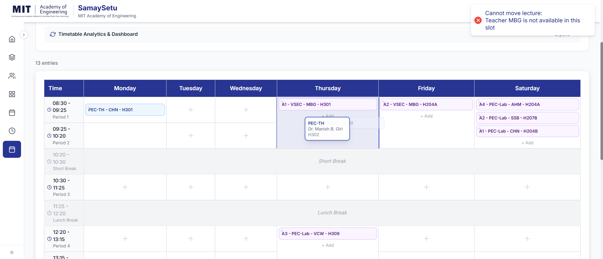
  <br/>
  <em>Figure 4: Conflict detection overlay notifying the scheduling coordinator of scheduling collisions with exact details.</em>
</p>

---

### 🔍 5. Pre-Publish Validation Check
A comprehensive scheduling validation checklist that verifies course hour quotas, teacher work limits, and breaks before publishing a schedule.

<p align="center">
  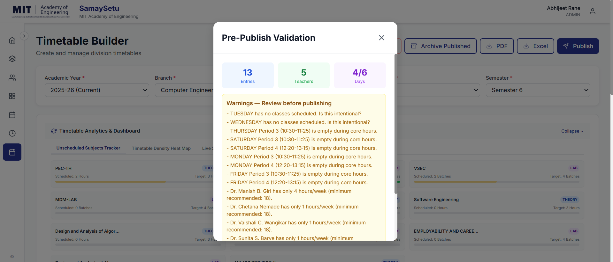
  <br/>
  <em>Figure 5: Automated schedule audit checklist displaying potential allocation warnings and verification checks.</em>
</p>

---

### 🏫 6. Resource Viewer (HOD Panel)
A unified schedule viewer allowing administrators to query occupancy and timetables by specific Classroom, Laboratory, or HOD faculty member.

<p align="center">
  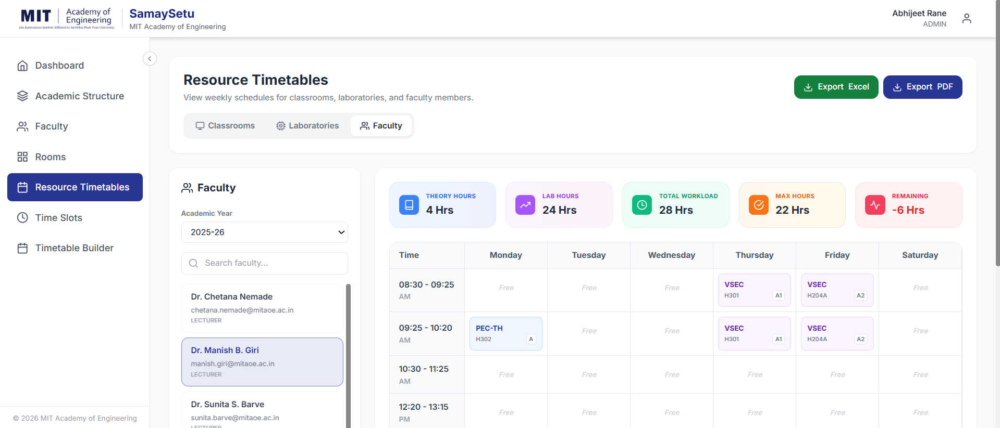
  <br/>
  <em>Figure 6.1: Unified resource viewer displaying the weekly teacher occupancy chart.</em>
</p>

<p align="center">
  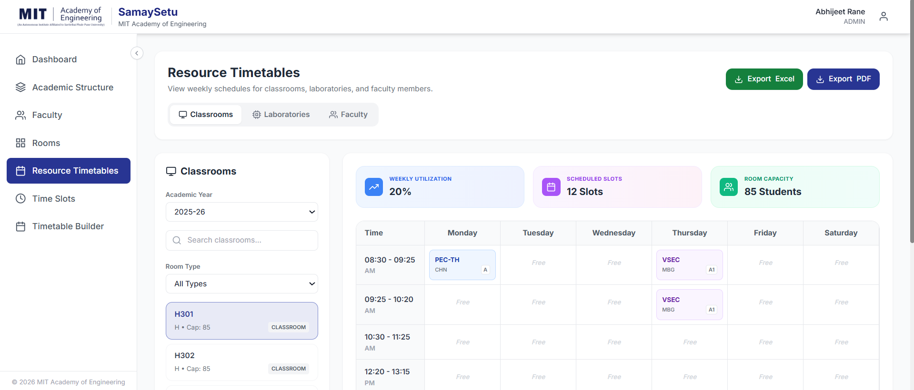
  <br/>
  <em>Figure 6.2: Unified resource viewer displaying the weekly classroom schedule.</em>
</p>

---

### 👤 7. Teacher Portal & Availability Declaration
Self-service views for teachers, featuring an interactive grid to submit slot-by-slot availability preferences (Preferred, Neutral, Unavailable).

<p align="center">
  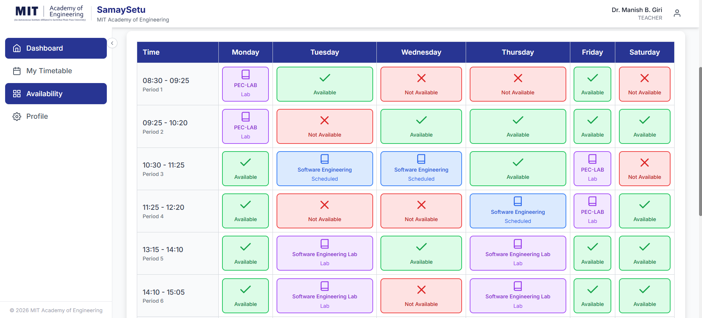
  <br/>
  <em>Figure 7: Faculty preference selection grid allowing teachers to indicate preferred and blocked time slots.</em>
</p>

---

### 👥 8. Faculty Registry & Bulk Onboarding
Management portal for administrative HODs to manage faculty records and perform bulk staff onboarding via CSV uploads with format validation.

<p align="center">
  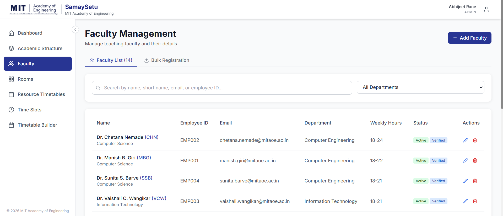
  <br/>
  <em>Figure 8: Teacher records registry containing full contact lists, active roles, and bulk CSV import controls.</em>
</p>

---

### ⚙️ 9. Academic Structure Configurator
Settings interface for configuring multi-department structures, academic years, course catalogs, student divisions, room capacities, and slots.

<p align="center">
  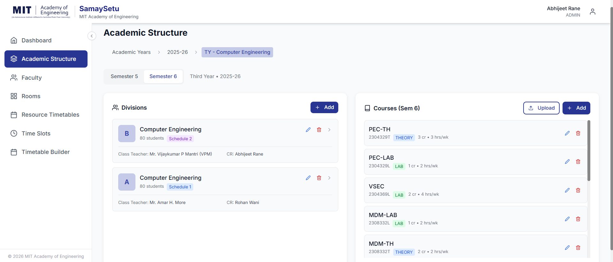
  <br/>
  <em>Figure 9: System configuration center showing department division lists, batch structures, and course attributes.</em>
</p>

---

### 📄 10. Institutional Document Exports
Generated PDF and Excel documents matching the official, institutional timetable layouts of universities (incorporating vertical text, signature blocks, and loading reports).

<p align="center">
  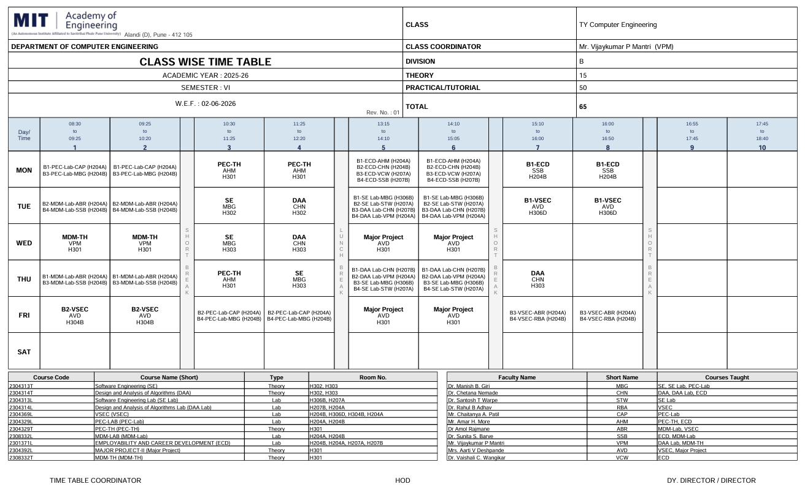
  <br/>
  <em>Figure 10: High-fidelity PDF export output matching the official formatting, complete with department signatures and workloads.</em>
</p>

---

## ✨ Features

### 🏗️ Academic Infrastructure Management
| Feature | Description |
|---------|-------------|
| **Multi-Department Hierarchy** | Manage departments → divisions → batches with academic year isolation |
| **Course Catalog** | Full CRUD with course codes, credit mapping, theory/lab classification, semester assignment, and short names |
| **Room & Lab Registry** | Track classrooms and labs with capacity, building, wing, room type, and real-time utilization metrics |
| **Time Slot Configuration** | Support for multiple schedule types (TYPE_1, TYPE_2, etc.) with configurable break intervals |
| **Faculty Management** | Bulk CSV import with template downloads, individual CRUD, and department-scoped access |

### 📅 Timetable Scheduling Engine
| Feature | Description |
|---------|-------------|
| **Interactive Timetable Builder** | Drag-and-drop scheduling interface with real-time conflict detection |
| **8-Point Conflict Validation** | Simultaneous checking for teacher, room, division, capacity, availability, break protection, weekly hour limits, and room-course type matching |
| **Lab Session Wizard** | Single-action creation of multi-batch lab sessions with automatic consecutive slot booking |
| **Draft → Publish → Archive** | Full lifecycle management with semester-specific versioning |
| **Cross-Division Copy** | Clone timetable structures between divisions for rapid scheduling |
| **Pre-Publish Validation** | Dashboard showing blocking errors vs. informational warnings before going live |

### 📊 Resource Timetable Views
| Feature | Description |
|---------|-------------|
| **Faculty Timetables** | View and export any teacher's weekly schedule with workload metrics |
| **Room/Lab Timetables** | Occupancy grids with utilization percentage tracking |
| **Department Overview** | Aggregated view of all division schedules within a department |

### 📥 Institutional Document Export
| Feature | Description |
|---------|-------------|
| **PDF Export** | Pixel-perfect institutional format with college headers, signature lines, vertical break columns, lab session merging, and teaching load tables |
| **Excel Export** | Styled `.xlsx` with merged cells, color-coded lab sessions, bordered grids, and metadata sheets |
| **4 Export Scopes** | Division, Faculty, Department, and Room/Lab — each with both PDF and Excel variants (8 endpoints total) |

### 🔐 Security & Access Control
| Feature | Description |
|---------|-------------|
| **6 Granular Roles** | `SUPER_ADMIN`, `ADMIN`, `DEPARTMENT_ADMIN`, `HOD`, `TIMETABLE_COORDINATOR`, `TEACHER` |
| **Department-Scoped Authorization** | Resources (courses, divisions, rooms, teachers) are isolated per department at the service layer |
| **JWT Stateless Auth** | Token-based authentication with BCrypt password hashing |
| **Account Lockout** | Automatic 15-minute lock after 5 failed login attempts |
| **Rate Limiting** | Redis-backed tiered rate limiting per IP and endpoint |
| **Security Headers** | HSTS, CSP, X-Frame-Options, nosniff, and cache-control enforcement |

### 👩‍🏫 Teacher Self-Service Portal
| Feature | Description |
|---------|-------------|
| **Personal Dashboard** | Today's classes, upcoming schedule, and department-wide timetable overview |
| **My Timetable** | Interactive weekly grid with PDF download for personal schedules |
| **Availability Management** | Set day/slot availability preferences that feed into the scheduling engine |
| **Profile Management** | Self-service profile updates with first-login password change enforcement |

### 📧 Communication & Onboarding
| Feature | Description |
|---------|-------------|
| **First-Login Onboarding** | Forced password change on initial login for all staff accounts |
| **Staff Onboarding Emails** | Automated welcome emails with credentials for bulk-imported faculty |
| **Password Reset Flow** | Secure token-based forgot/reset password workflow |

---

## 🛠️ Tech Stack

### Frontend
| Technology | Purpose |
|-----------|---------|
| **React 18** | Component-based UI framework |
| **TypeScript** | Type-safe development |
| **Vite** | Lightning-fast build tooling |
| **Tailwind CSS** | Utility-first responsive styling |
| **Zustand** | Lightweight state management |
| **@dnd-kit** | Drag-and-drop timetable interactions |
| **Framer Motion** | Smooth animations and transitions |
| **React Router v6** | Client-side routing with role-based guards |
| **Axios** | HTTP client with interceptors for auth |

### Backend
| Technology | Purpose |
|-----------|---------|
| **Java 17** | Core language |
| **Spring Boot 3.5.5** | Application framework |
| **Spring Security** | Authentication & role-based authorization |
| **Spring Data JPA** | ORM with Hibernate |
| **PostgreSQL 17** | Primary relational database |
| **Redis** | Caching layer + rate limiting store |
| **Flyway** | Database migration management |
| **JJWT 0.12** | JWT token generation and validation |
| **Apache POI** | Excel document generation |
| **OpenPDF** | PDF document generation |
| **Lombok** | Boilerplate reduction |

### DevOps & Infrastructure
| Technology | Purpose |
|-----------|---------|
| **GitHub Actions** | CI/CD pipelines (5 workflows) |
| **AWS EC2** | Backend hosting with Auto Scaling |
| **Terraform** | Infrastructure as Code (AWS provisioning) |
| **Vercel** | Frontend hosting and CDN |
| **JaCoCo** | Code coverage reporting |

---

## 📐 System Architecture

### High-Level Architecture

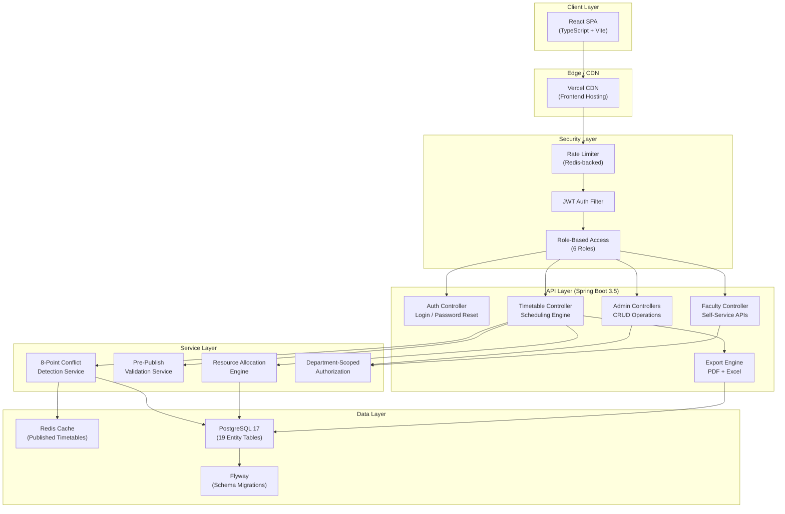

### Entity Relationship Model

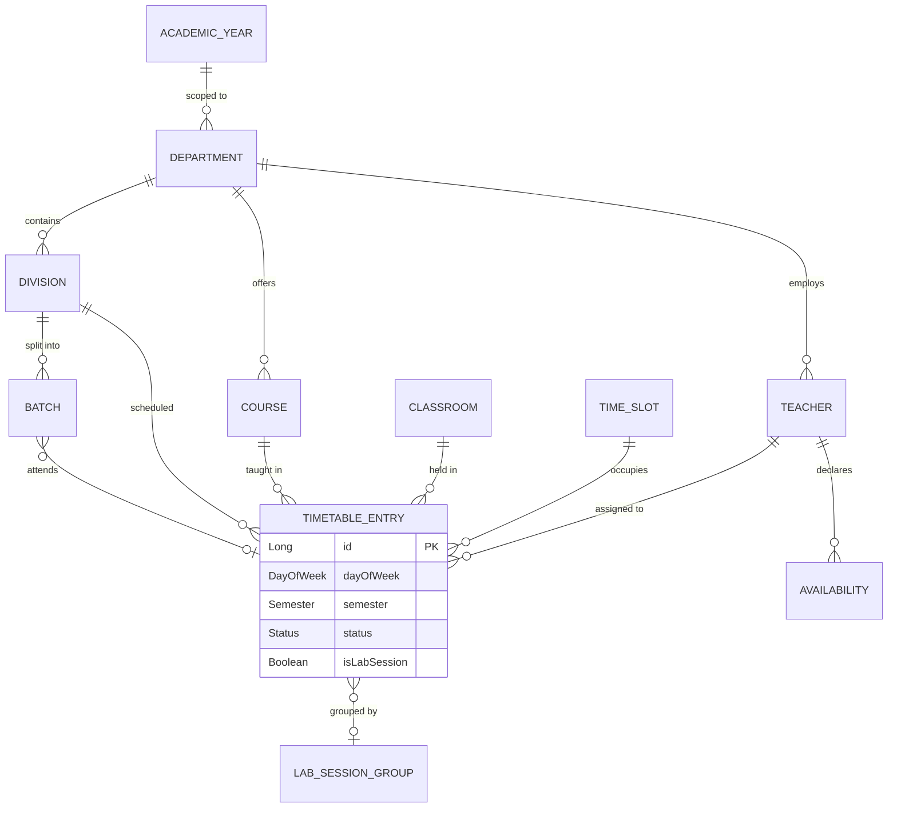

### 8-Point Conflict Detection Flow

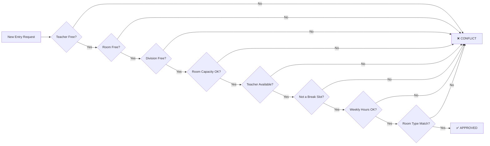

---

## ⚡ Engineering Highlights

### 1. Dynamic Slot Type Alignment
**Problem:** Different academic divisions use different schedule tracks (TYPE_1, TYPE_2, etc.), but teachers and rooms are shared resources across divisions. A hardcoded slot filter breaks rendering for non-default configurations.

**Solution:** Implemented a dynamic slot detection algorithm that inspects fetched timetable entries at runtime, identifies the active time slot configuration, and selectively maps grid cells — ensuring consistency between the web UI and exported PDF/Excel documents.

### 2. Institutional-Grade PDF Compiler
**Problem:** Standard HTML-to-PDF libraries cannot produce the precise institutional document format required by universities — landscape layouts, vertical break-column text rendering, merged lab session cells, and signature sections.

**Solution:** Built a low-level PDF document compiler (209KB of generation logic) that constructs coordinate-based tables, manages character-level vertical text rendering, auto-fits division layouts, and embeds institutional headers with workload computation tables — matching the exact format of official institutional documents.

### 3. Lab Session Orchestration
**Problem:** Lab sessions span consecutive time slots across multiple batches, requiring atomic allocation of 3+ timetable entries that must all succeed or all fail, while respecting batch-level room and teacher constraints.

**Solution:** Designed a lab session group entity with a wizard-driven creation flow that atomically reserves consecutive slots, assigns batch-level room and teacher combinations, and validates all 8 conflict points for each sub-entry before committing the group.

### 4. Department-Scoped Multi-Tenancy
**Problem:** A university platform requires that HODs and department admins can only manage their own department's resources, while super admins have full cross-department access.

**Solution:** Implemented a department authorization service that intercepts every resource access (courses, divisions, rooms, teachers) and validates ownership against the authenticated user's department chain — enforced at the service layer, not just the UI.

### 5. Redis-Backed Performance Layer
**Problem:** Published timetables are read-heavy (viewed by hundreds of teachers and students) but write-infrequent (changed only during scheduling windows).

**Solution:** Implemented a cache-aside pattern using Redis for published timetables, with automatic cache eviction on publish/archive/entry-modification operations. Combined with tiered rate limiting (also Redis-backed) to protect against brute-force attacks.

---

## 📊 Project Scale

| Metric | Value |
|--------|-------|
| **Backend Services** | 17 service classes |
| **API Controllers** | 13 REST controllers |
| **Data Entities** | 19 entity/enum classes |
| **Frontend Components** | 30+ React components |
| **Export Engine** | 209KB of document generation logic |
| **Conflict Checks** | 8 simultaneous validation points |
| **User Roles** | 6 granular permission levels |
| **Export Endpoints** | 8 (PDF + Excel × 4 scopes) |
| **CI/CD Workflows** | 5 GitHub Actions pipelines |

---

## 🗂️ Repository Structure

> The following illustrates the production repository structure. Source code is maintained in a private repository; this public repository contains architectural documentation only.

```
SamaySetu/
├── Backend/                          # Spring Boot 3.5.5 API Server
│   ├── src/main/java/.../
│   │   ├── Controller/               # 13 REST controllers
│   │   ├── Service/                  # 17 business logic services
│   │   ├── Entity/                   # 19 JPA entities & enums
│   │   ├── Repository/               # 12 Spring Data JPA repositories
│   │   ├── IO/                       # 19 DTOs and request/response models
│   │   ├── Filter/                   # JWT auth + rate limiting filters
│   │   ├── Configuration/            # Security, Redis, CORS config
│   │   └── Util/                     # JWT utility, conflict exceptions
│   └── src/main/resources/
│       ├── db/migration/             # Flyway SQL migrations
│       └── application.properties    # Environment configuration
│
├── Frontend/                         # React 18 + TypeScript SPA
│   ├── src/
│   │   ├── components/
│   │   │   ├── admin/                # 12 admin panel components
│   │   │   ├── auth/                 # Route protection
│   │   │   ├── common/               # Reusable UI primitives
│   │   │   ├── dashboard/            # Dashboard widgets
│   │   │   └── layout/               # Navbar + collapsible sidebar
│   │   ├── pages/                    # Page-level components
│   │   │   ├── admin/                # Admin profile
│   │   │   └── teacher/              # Timetable, availability, profile
│   │   ├── services/                 # API client layer
│   │   ├── store/                    # Zustand state management
│   │   ├── types/                    # TypeScript interfaces
│   │   └── hooks/                    # Custom React hooks
│   └── public/                       # Static assets
│
├── .github/workflows/                # 5 CI/CD pipelines
├── docs/                             # System design and architecture docs (Public Showcase)
│   ├── assets/                       # Image assets and logo
│   │   └── screenshots/              # 10 Project UI screenshots (login_page.png, etc.)
│   ├── architecture.md               # Detailed system architecture
│   ├── database-schema.md            # Entity relations and schema description
│   ├── deployment.md                 # Deployment targets and pipelines (AWS/Azure)
│   ├── features.md                   # Comprehensive feature reference
│   └── security.md                   # Security specifications and audit details
├── infra/                            # Terraform IaC (AWS provisioning)
└── Scripts/                          # Database seed data
```

---

## 🔒 Security Architecture

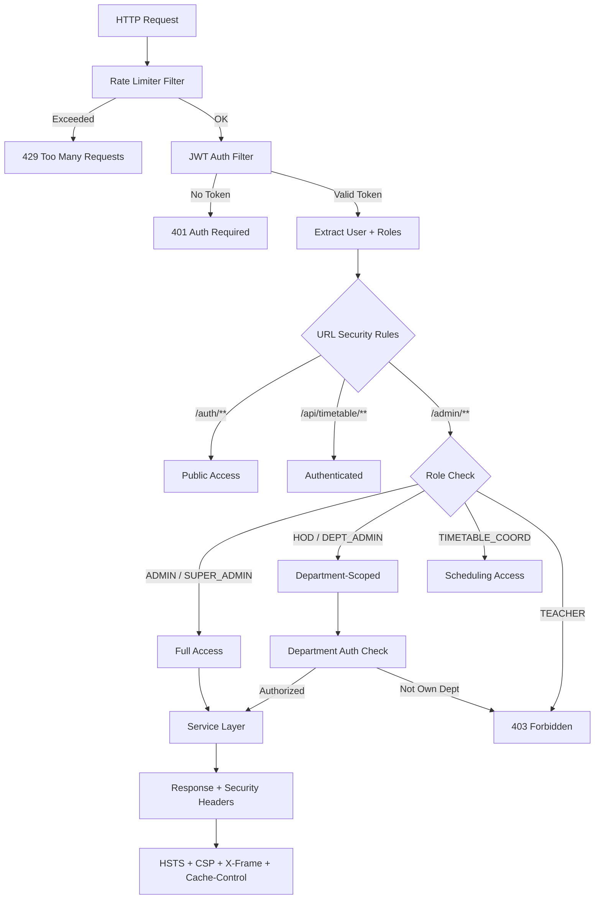

---

## 📧 Communication Flows

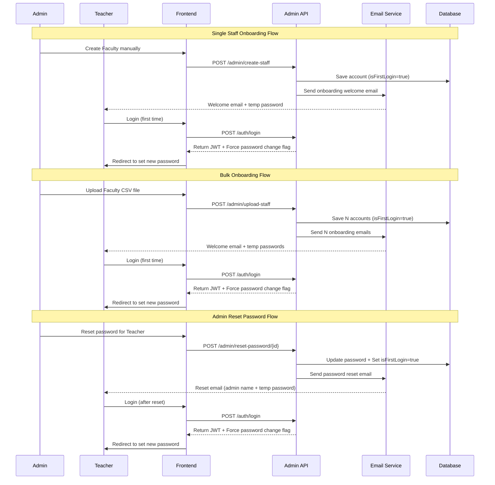

---

## 📄 License

This repository is published under a **Proprietary Showcase License**. See [LICENSE](LICENSE) for full terms.

**In summary:**
- ✅ View, study, and reference for educational purposes
- ✅ Cite in academic or professional contexts
- ❌ No commercial use, redistribution, or derivative works
- ❌ No copying of architectural patterns or algorithms for competing products
- ❌ No deployment or hosting of any part of this codebase

All intellectual property rights, including pending patent claims, are fully reserved.

---

<p align="center">
  <sub>Built with precision engineering and institutional domain expertise.</sub>
</p>
