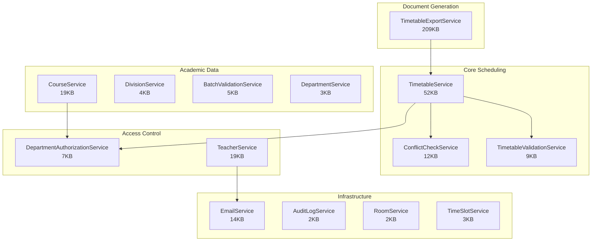
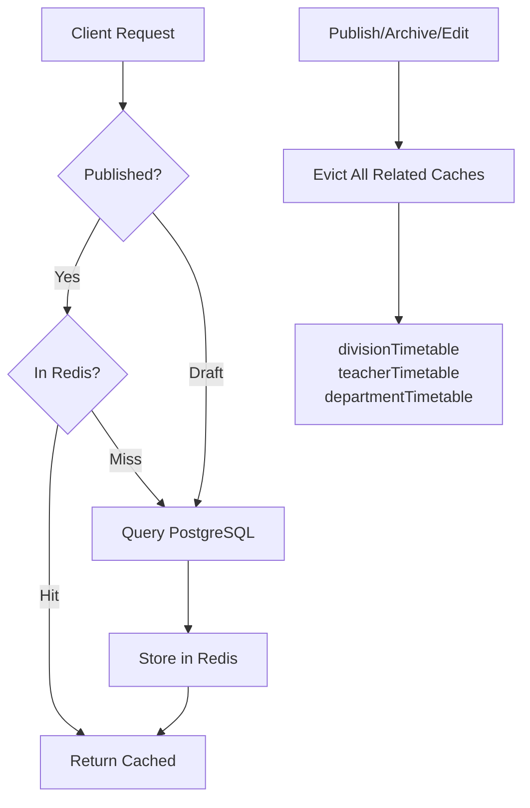
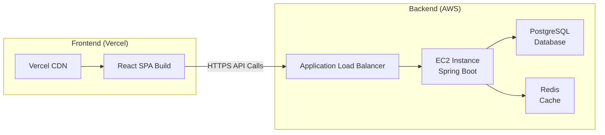

# System Architecture

> [!IMPORTANT]
> This document provides high-level architectural documentation for the SamaySetu platform. Implementation details and source code are maintained in the private production repository.

---

## Overview

SamaySetu follows a clean **3-tier architecture** with a React SPA frontend, Spring Boot REST API backend, and PostgreSQL persistence layer augmented by Redis caching.

```
┌─────────────────────────────────────────────────────────────────┐
│                        CLIENT TIER                              │
│  React 18 SPA + TypeScript + Vite                               │
│  ├── Zustand (State Management)                                 │
│  ├── @dnd-kit (Drag-and-Drop Scheduling)                        │
│  ├── Framer Motion (Animations)                                 │
│  └── Axios + JWT Interceptors (API Communication)               │
├─────────────────────────────────────────────────────────────────┤
│                      API / SERVICE TIER                          │
│  Spring Boot 3.5 + Spring Security + JPA                        │
│  ├── 13 REST Controllers                                        │
│  ├── 17 Business Services                                       │
│  ├── JWT Auth Filter + Rate Limiter                             │
│  ├── 8-Point Conflict Detection Engine                          │
│  ├── Institutional Export Compiler (PDF + Excel)                │
│  └── Department-Scoped Authorization Service                    │
├─────────────────────────────────────────────────────────────────┤
│                        DATA TIER                                │
│  PostgreSQL 17 (Primary)  +  Redis (Cache + Rate Limiting)      │
│  ├── 19 Entity Tables (Flyway-managed migrations)               │
│  ├── 12 JPA Repositories                                        │
│  └── Cache-aside pattern for published timetables               │
└─────────────────────────────────────────────────────────────────┘
```

---

## Backend Service Map

The backend is organized into focused, single-responsibility services:



---

## API Architecture

### Authentication Flow

```
POST /auth/login           → JWT token issuance
POST /auth/forgot-password → Send reset token
POST /auth/reset-password  → Reset with token
POST /auth/change-password → First-login forced change
```

### Admin APIs (Role-Protected)

```
/admin/api/departments     → Department CRUD
/admin/api/divisions       → Division CRUD
/admin/api/courses         → Course CRUD + short name validation
/admin/api/rooms           → Room CRUD
/admin/api/batches         → Batch CRUD + strength validation
/admin/api/time-slots      → Time slot CRUD
/admin/api/academic-years  → Academic year CRUD
/admin/upload-staff        → CSV bulk faculty import
/admin/create-staff        → Individual faculty creation
```

### Timetable APIs

```
# Scheduling Operations
POST   /api/timetable/entries          → Create entry (conflict-checked)
PUT    /api/timetable/entries/{id}     → Update entry
DELETE /api/timetable/entries/{id}     → Delete entry
POST   /api/timetable/lab-groups       → Create lab session group
POST   /api/timetable/lab-session      → Add lab session entry
POST   /api/timetable/publish          → Publish draft → live
POST   /api/timetable/archive          → Archive published version
POST   /api/timetable/copy             → Copy between divisions

# Read Operations
GET    /api/timetable/draft            → Draft entries (admin)
GET    /api/timetable/editable         → Draft + Published (admin editing)
GET    /api/timetable/division/{id}    → Published division timetable
GET    /api/timetable/teacher/{id}     → Published teacher timetable
GET    /api/timetable/department/{id}  → Published department timetable
GET    /api/timetable/room/{id}        → Room occupancy grid
GET    /api/timetable/validate         → Pre-publish validation report
GET    /api/timetable/analytics        → Scheduling analytics

# Availability Filtering
GET    /api/timetable/available-rooms     → Free rooms for a slot
GET    /api/timetable/available-teachers  → Free teachers for a slot
GET    /api/timetable/available-batches   → Free batches for a slot

# Export (8 endpoints)
GET    /api/timetable/export/division/{id}/pdf
GET    /api/timetable/export/division/{id}/excel
GET    /api/timetable/export/teacher/{id}/pdf
GET    /api/timetable/export/teacher/{id}/excel
GET    /api/timetable/export/department/{id}/pdf
GET    /api/timetable/export/department/{id}/excel
GET    /api/timetable/export/room/{id}/pdf
GET    /api/timetable/export/room/{id}/excel
```

### Faculty Self-Service APIs

```
GET  /api/faculty/my-timetable          → Authenticated teacher's timetable
GET  /api/faculty/department-timetable  → Department-wide view
GET  /api/staff/profile                 → View own profile
PUT  /api/staff/profile                 → Update own profile
POST /api/staff/availability            → Save availability preferences
```

---

## Caching Strategy



**Cache keys:**
- `divisionTimetable::{divisionId}_{academicYearId}`
- `teacherTimetable::{teacherId}_{academicYearId}`
- `departmentTimetable::{departmentId}_{academicYearId}`

**Eviction triggers:** Any timetable entry create, update, delete, publish, archive, or copy operation.

---

## Deployment Architecture



> [!NOTE]
> The diagram above illustrates the target production deployment architecture designed for AWS infrastructure (fully managed and provisioned via Terraform IaC). For the live preview environment, the backend API services are hosted on Azure App Service connecting to Azure Database for PostgreSQL and Azure Cache for Redis.

---

## Data Model Summary

| Entity | Key Relationships |
|--------|------------------|
| **AcademicYear** | Root entity — departments, courses, and divisions are scoped per year |
| **Department** | Belongs to an academic year; owns divisions, courses, and teachers |
| **Division** | Belongs to a department; contains batches; has timetable entries |
| **Course** | Belongs to a department; typed as THEORY or LAB; has credit/hour mapping |
| **Teacher** | Belongs to a department; has a role; declares availability preferences |
| **ClassRoom** | Has capacity, type, building, wing; shared across departments |
| **TimeSlot** | Has start/end time, type (TYPE_1/TYPE_2), and break flag |
| **Batch** | Belongs to a division; used for lab session scheduling |
| **TimetableEntry** | Links division + day + slot + course + teacher + room + semester + status |
| **LabSessionGroup** | Groups multiple TimetableEntries for atomic lab session creation |
| **TeacherAvailability** | Day + time slot availability preference for a teacher |
