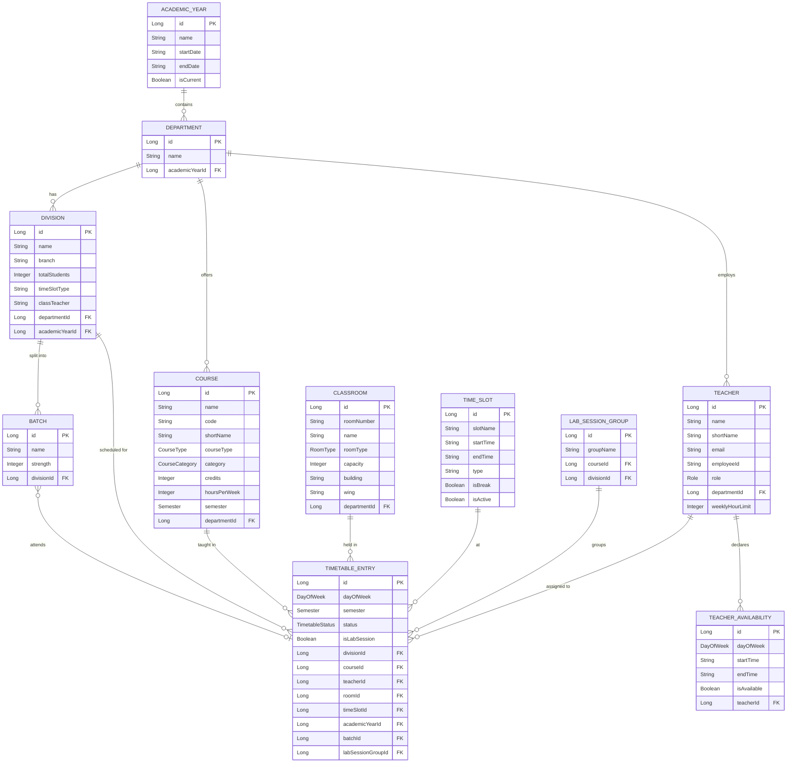

# Database Schema Reference

> [!IMPORTANT]
> This document provides a high-level reference of the data model. Actual column definitions, constraints, indexes, and migration scripts are maintained in the private production repository.

---

## Entity-Relationship Overview



---

## Enumeration Types

### DayOfWeek
```
MONDAY | TUESDAY | WEDNESDAY | THURSDAY | FRIDAY | SATURDAY
```

### Semester
```
SEM_1 | SEM_2 | SEM_3 | SEM_4 | SEM_5 | SEM_6 | SEM_7 | SEM_8
```

### TimetableStatus
```
DRAFT | PUBLISHED | ARCHIVED
```

### CourseType
```
THEORY | LAB
```

### CourseCategory
```
CORE | ELECTIVE
```

### RoomType
```
CLASSROOM | LAB
```

### Role (Teacher)
```
TEACHER | TIMETABLE_COORDINATOR | HOD | DEPARTMENT_ADMIN | ADMIN | SUPER_ADMIN
```

---

## Key Relationships

| Relationship | Cardinality | Description |
|-------------|-------------|-------------|
| AcademicYear → Department | 1:N | Departments are scoped per academic year |
| Department → Division | 1:N | Each department has multiple class divisions |
| Division → Batch | 1:N | Divisions are split into lab batches |
| Division → TimetableEntry | 1:N | Each division has many scheduled entries |
| Course → TimetableEntry | 1:N | A course appears in multiple time slots |
| Teacher → TimetableEntry | 1:N | A teacher is assigned to multiple entries |
| Classroom → TimetableEntry | 1:N | A room hosts multiple entries |
| TimeSlot → TimetableEntry | 1:N | A time slot contains entries across divisions |
| LabSessionGroup → TimetableEntry | 1:N | Groups related lab entries for atomic operations |

---

## Database Technology

| Aspect | Technology |
|--------|-----------|
| **RDBMS** | PostgreSQL 17 |
| **ORM** | Hibernate (via Spring Data JPA) |
| **Migrations** | Flyway (versioned SQL scripts) |
| **Connection Pool** | HikariCP (Spring Boot default) |
| **Cache** | Redis (cache-aside for published timetables) |
