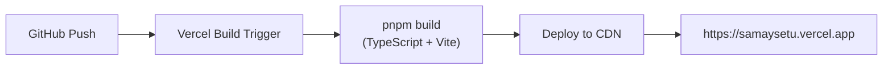
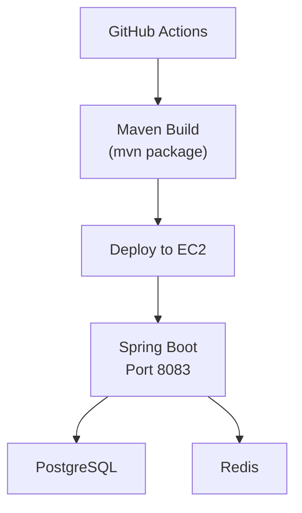
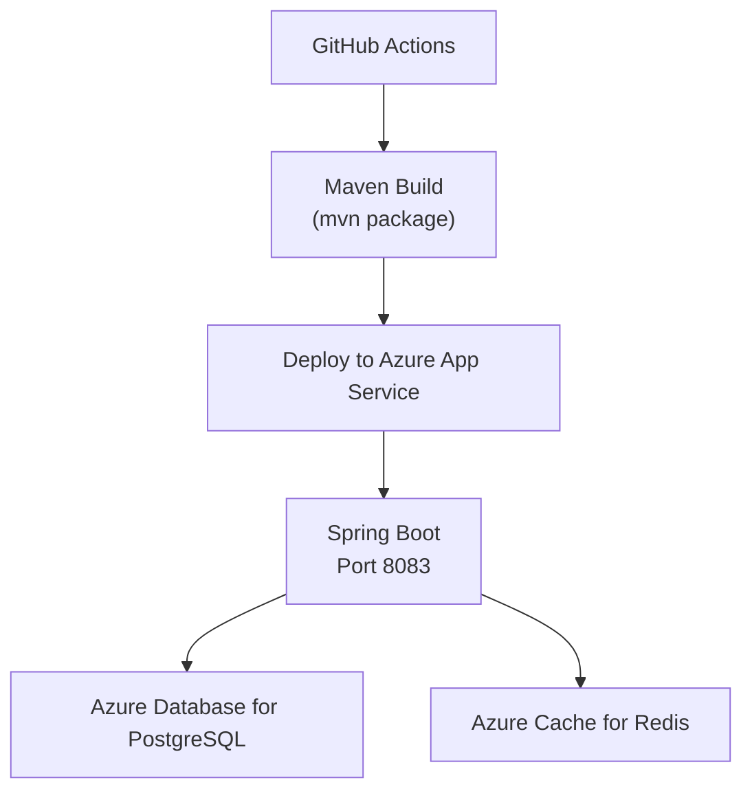

# Deployment Guide

> [!NOTE]
> This document describes the deployment architecture at a high level. Environment-specific configurations, secrets, and infrastructure-as-code scripts are maintained in the private production repository.

---

## Architecture Overview

SamaySetu uses a split deployment model:

| Component | Production Platform | Preview Platform | Purpose |
|-----------|---------------------|------------------|---------|
| **Frontend** | Vercel | Vercel | React SPA hosting with global CDN |
| **Backend** | AWS EC2 (Auto Scaling) | Azure App Service | Spring Boot API server |
| **Database** | PostgreSQL (RDS / EC2) | Azure PostgreSQL (Flexible Server) | Relational data persistence |
| **Cache** | Redis (ElastiCache / EC2) | Azure Cache for Redis | Published timetable caching + rate limiting |

---

## Frontend Deployment (Vercel)



### Configuration
- **Framework:** Vite
- **Build Command:** `pnpm build`
- **Output Directory:** `dist`
- **Environment Variables:**
  - `VITE_API_BASE_URL` — Backend API endpoint

---

## Backend Deployment (AWS)



### Infrastructure Components

| Component | AWS Service | Purpose |
|-----------|------------|---------|
| Compute | EC2 (Auto Scaling) | Spring Boot application hosting |
| Load Balancer | Application Load Balancer | HTTPS termination + routing |
| Database | PostgreSQL (self-managed) | Primary data store |
| Cache | Redis (self-managed) | Caching + rate limiting |

### CI/CD Pipelines

| Workflow | Trigger | Purpose |
|----------|---------|---------|
| `ci.yml` | Push / PR | Build + test (backend + frontend) |
| `code-quality.yml` | Push / PR | Linting, type checking, code quality |
| `pr-checks.yml` | Pull Request | Comprehensive PR validation |
| `deploy-backend-aws.yml` | Manual | Production backend deployment |
| `deploy-preview-version.yml` | Push / PR (preview branch) | Preview environment deployment |

### Infrastructure as Code (Terraform)

Production infrastructure is provisioned and managed using **Terraform**, ensuring reproducible and version-controlled deployments:

| Resource | Configuration |
|----------|---------------|
| Compute | EC2 Auto Scaling Group |
| Networking | Application Load Balancer + HTTPS termination |
| Database | PostgreSQL instance |
| Cache | Redis instance |
| State Management | S3 backend + DynamoDB state locking |

- Infrastructure definitions stored in `infra/terraform/`
- Environment-specific values configured via `terraform.tfvars`
- All infrastructure changes are reviewed through pull requests before applying

---

## Preview Backend Deployment (Azure)

The live preview/demo at **[https://samaysetu.vercel.app](https://samaysetu.vercel.app)** interacts with backend API services deployed on Azure App Service.



### Infrastructure Components

| Component | Azure Service | Purpose |
|-----------|---------------|---------|
| Compute | Azure App Service (`samaysetu-preview-api`) | Spring Boot application hosting |
| Database | Azure Database for PostgreSQL (Flexible Server) | Relational data persistence |
| Cache | Azure Cache for Redis | Caching + rate limiting |

- CI/CD workflow defined in `.github/workflows/deploy-preview-version.yml`
- Runs automatically on any push or pull request to the `preview` branch

---

## Environment Configuration

### Required Environment Variables

**Backend (application.properties):**
```
# Database
spring.datasource.url=jdbc:postgresql://<host>:5432/<db>
spring.datasource.username=<username>
spring.datasource.password=<password>

# Redis
spring.data.redis.host=<redis-host>
spring.data.redis.port=6379

# JWT
jwt.secret=<256-bit-secret>
jwt.expiration=<ms>

# Email (SMTP)
spring.mail.host=<smtp-host>
spring.mail.port=587
spring.mail.username=<email>
spring.mail.password=<app-password>

# CORS
app.cors.allowed-origins=https://samaysetu.vercel.app

# Server
server.port=8083
```

**Frontend (.env):**
```
VITE_API_BASE_URL=https://api.yourdomain.com
```

---

## Database Migrations

Database schema changes are managed by **Flyway**:

- Migration files are stored in `src/main/resources/db/migration/`
- Naming convention: `V{version}__{description}.sql`
- Migrations run automatically on application startup
- Rollback scripts are maintained for critical migrations

---

## Health Monitoring

| Endpoint | Purpose |
|----------|---------|
| `/actuator/health` | Application health check (public) |
| Server logs | Structured logging with `[AUDIT]`, `[JWT]`, `[SEC]` prefixes |
