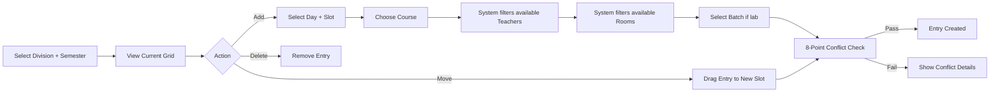
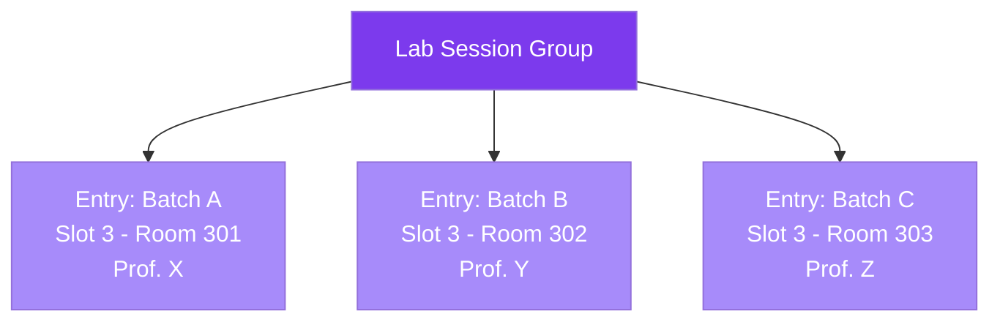
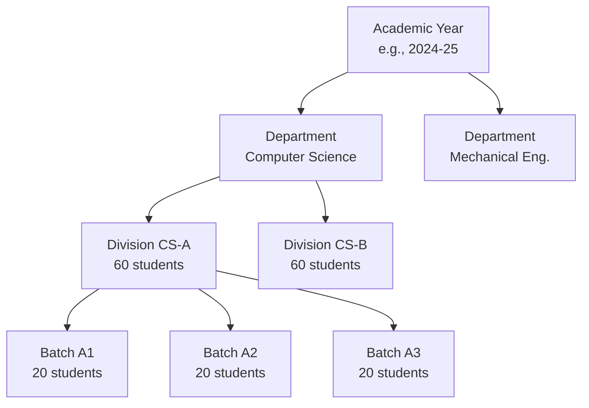
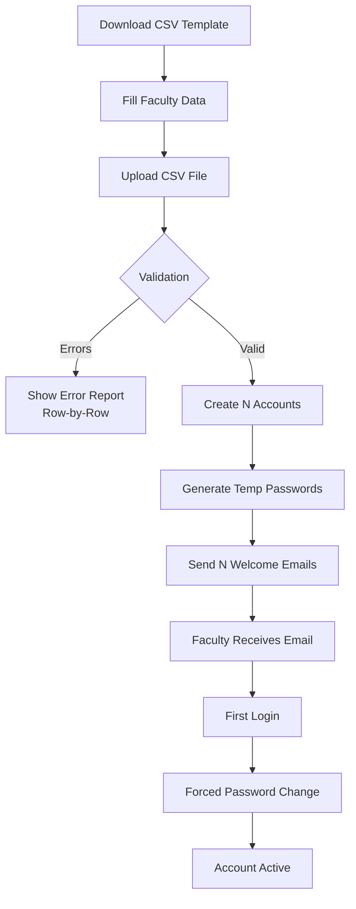
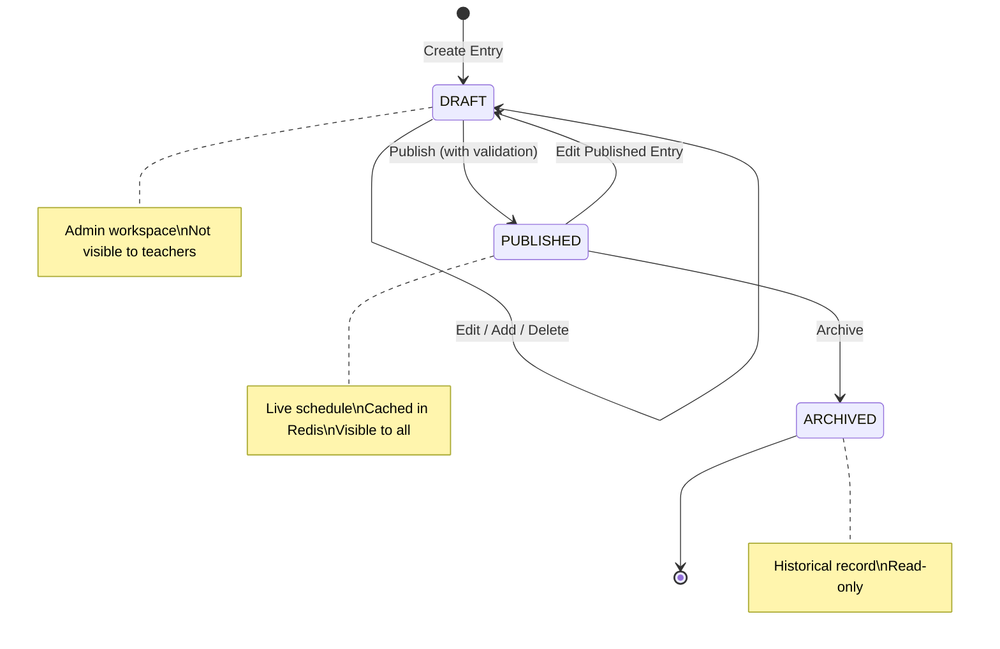

# Feature Documentation

> [!NOTE]
> This document provides a detailed feature reference for the SamaySetu platform. Each section documents the functional capabilities, user workflows, and engineering considerations behind a major feature area.

---

## Table of Contents

- [1. Timetable Builder](#1-timetable-builder)
- [2. Conflict Detection Engine](#2-conflict-detection-engine)
- [3. Lab Session Management](#3-lab-session-management)
- [4. Institutional Document Export](#4-institutional-document-export)
- [5. Resource Timetable Views](#5-resource-timetable-views)
- [6. Academic Structure Management](#6-academic-structure-management)
- [7. Faculty Management & Onboarding](#7-faculty-management--onboarding)
- [8. Teacher Self-Service Portal](#8-teacher-self-service-portal)
- [9. Timetable Lifecycle Management](#9-timetable-lifecycle-management)
- [10. Analytics & Dashboard](#10-analytics--dashboard)

---

## 1. Timetable Builder

### Overview
The timetable builder is the central scheduling interface — a 110KB+ React component that provides a visual, drag-and-drop grid for creating and managing class schedules.

### Key Capabilities

| Capability | Description |
|-----------|-------------|
| **Visual Grid** | Days (Monday–Saturday) × Time Slots matrix with real-time entry display |
| **Drag-and-Drop** | Built with @dnd-kit for intuitive slot-to-slot entry movement |
| **Smart Dropdowns** | When adding an entry, only available rooms, teachers, and batches for that specific day/slot are shown |
| **Inline Conflict Alerts** | Immediate visual feedback when a proposed allocation conflicts with existing entries |
| **Semester Filtering** | Switch between SEM_1 through SEM_8 to manage semester-specific schedules |
| **Division Selection** | Select any division within the user's department scope |
| **Entry Cards** | Color-coded cards (blue for theory, purple for labs) showing course, teacher, room, and batch info |

### Workflow



---

## 2. Conflict Detection Engine

### Overview
Every timetable entry creation or modification passes through an 8-point real-time conflict detection engine before being persisted.

### The 8 Validation Points

| # | Check | Description |
|---|-------|-------------|
| 1 | **Teacher Availability** | Is the assigned teacher free on this day/slot across all divisions? |
| 2 | **Room Availability** | Is the room free on this day/slot across all timetables? |
| 3 | **Division Availability** | Is the division free on this day/slot (no double-booking students)? |
| 4 | **Room Capacity** | Can the room accommodate the division/batch strength? |
| 5 | **Teacher Preference** | Has the teacher marked this slot as available in their preferences? |
| 6 | **Break Protection** | Is this a break slot? (entries cannot be placed on break slots) |
| 7 | **Weekly Hour Limit** | Will this entry exceed the course's configured hours-per-week? |
| 8 | **Room-Course Type Match** | Does the room type match the course type? (labs in lab rooms, theory in classrooms) |

### Conflict Response

```json
{
  "hasConflict": true,
  "conflicts": [
    {
      "type": "TEACHER_CONFLICT",
      "message": "Dr. Smith is already teaching CS301 in Division B at this time",
      "existingEntry": { ... }
    },
    {
      "type": "ROOM_CONFLICT", 
      "message": "Room 204 is occupied by ME201 at this time",
      "existingEntry": { ... }
    }
  ]
}
```

---

## 3. Lab Session Management

### Overview
Lab sessions are fundamentally different from theory classes — they span consecutive time slots, involve batch-level (not division-level) scheduling, and require atomic creation of multiple entries.

### Lab Session Group Concept



### Creation Wizard

1. **Select Lab Course** → filters to LAB-type courses only
2. **Select Day & Starting Slot** → system validates consecutive slot availability
3. **Assign Batches** → each batch gets its own room and teacher assignment
4. **Atomic Validation** → all entries are conflict-checked together
5. **Atomic Commit** → all entries are created together or none are created

### Key Constraints
- Lab entries are linked by a `LabSessionGroup` entity
- Deleting one entry in a group deletes the entire group
- Lab entries span 2 consecutive time slots (configurable)
- Each batch within the group can have a different room and teacher

---

## 4. Institutional Document Export

### Overview
The export engine generates publication-ready PDF and Excel documents that match the exact institutional format standards — with college headers, signature sections, and formatted grids.

### Export Scopes

| Scope | PDF | Excel | Description |
|-------|-----|-------|-------------|
| **Division** | ✅ | ✅ | Complete weekly timetable for a class division |
| **Faculty** | ✅ | ✅ | Teacher's personal weekly schedule with teaching load table |
| **Department** | ✅ | ✅ | All divisions within a department |
| **Room/Lab** | ✅ | ✅ | Room occupancy grid with utilization metrics |

### PDF Document Structure (Faculty Example)

```
┌─────────────────────────────────────────────────┐
│ [College Logo]  INSTITUTION NAME                │
│                 Department of Computer Science   │
│                 Academic Year: 2024-25           │
├─────────────────────────────────────────────────┤
│ Faculty: Dr. John Smith    Employee ID: EMP001  │
│ Designation: Associate Professor                │
├─────┬───────┬───────┬───────┬───────┬───────────┤
│     │ Mon   │ Tue   │ Wed   │ Thu   │ Fri  │Sat│
├─────┼───────┼───────┼───────┼───────┤      │   │
│9:00 │ CS301 │  ---  │ CS301 │ CS401 │ ...  │...│
│     │ A-204 │       │ B-301 │ A-204 │      │   │
├─────┼───────┼───────┼───────┼───────┤      │   │
│ S   │       │       │       │       │      │   │
│ H   │       Short Break     │       │      │   │
│ O   │       │       │       │       │      │   │
│ R   │       │       │       │       │      │   │
│ T   │       │       │       │       │      │   │
├─────┼───────┼───────┼───────┼───────┤      │   │
│10:00│ CS401 │ LAB   │  ---  │  ---  │ ...  │...│
│     │ A-204 │ Lab3  │       │       │      │   │
├─────┴───────┴───────┴───────┴───────┴──────┴───┤
│ TEACHING LOAD                                   │
│ ┌────────┬─────────┬───────┐                    │
│ │ TH (4) │ PR (6)  │ = 10  │                    │
│ └────────┴─────────┴───────┘                    │
├─────────────────────────────────────────────────┤
│ Signature: _____________ Date: _____________    │
└─────────────────────────────────────────────────┘
```

### Engineering Details
- **PDF Engine:** OpenPDF with coordinate-level table construction
- **Excel Engine:** Apache POI with styled worksheets, merged cells, and purple lab highlighting
- **Break Columns:** Vertical text rendering (character-by-character rotation)
- **Lab Merging:** Colspan detection for consecutive lab session slots
- **Dynamic Slot Detection:** Automatically detects TYPE_1/TYPE_2 slot configurations from entry data

---

## 5. Resource Timetable Views

### Overview
Three specialized views allow administrators to inspect timetables from the perspective of rooms, labs, or faculty members.

### View Modes

| Mode | Selection | Grid Display |
|------|-----------|-------------|
| **Classrooms** | Select room from filterable list (by type, building) | Weekly occupancy showing which divisions/courses use the room |
| **Labs** | Select lab room from dedicated lab list | Weekly occupancy with batch-level detail |
| **Faculty** | Select teacher from searchable list | Teacher's personal schedule across all divisions |

### Utilization Metrics
- **Room Utilization %** = (Occupied Slots / Total Available Slots) × 100
- Displayed as a live percentage badge next to the room name
- Helps identify underutilized and over-booked rooms

---

## 6. Academic Structure Management

### Overview
A unified 60KB+ component that manages the entire academic hierarchy through a tabbed interface.

### Hierarchy



### Tab Structure
1. **Academic Years** — Create/edit academic years, set current active year
2. **Departments** — CRUD departments, copy structure between academic years
3. **Divisions** — CRUD divisions with class teacher, representative, and time slot type assignment
4. **Batches** — CRUD batches with strength validation (total must equal division strength)
5. **Courses** — CRUD courses with type, credits, semester, category, short name

---

## 7. Faculty Management & Onboarding

### Bulk Import Workflow



### Individual Creation
- Manual form with all fields: name, email, department, employee ID, role
- Supports assigning any of the 6 roles
- Automatic welcome email with temporary credentials
---

## 8. Teacher Self-Service Portal

### Dashboard
- **Today's Classes:** Filtered view of current day's schedule
- **Quick Stats:** Total classes/week, hours/week, rooms used
- **Department Timetable:** View all division schedules in own department

### My Timetable
- Interactive weekly grid matching the admin timetable view
- Color-coded entries (blue = theory, purple = lab)
- One-click PDF download of personal schedule

### Availability Management
- Visual day × slot grid with toggle buttons
- Green = available, Red = unavailable, Blue = scheduled (locked)
- Bulk actions: "Mark All Available" / "Mark All Unavailable"
- Saved preferences feed into the scheduling engine's conflict detection

---

## 9. Timetable Lifecycle Management

### Status Flow



### Pre-Publish Validation
Before publishing, a comprehensive validation report categorizes issues as:

| Severity | Example | Action |
|----------|---------|--------|
| 🔴 **Blocking Error** | Teacher double-booked across divisions | Must fix before publish |
| 🟡 **Warning** | Room at 95% capacity | Can publish with acknowledgment |
| 🟢 **Info** | Teacher has 2 free slots remaining | No action needed |

---

## 10. Analytics & Dashboard

### Admin Dashboard Metrics
- **Total Published Entries** across all divisions
- **Teacher Coverage** — % of teachers with at least one scheduled class
- **Room Utilization** — Average occupancy across all rooms
- **Scheduling Density** — Entries per available slot ratio

### Scheduling Analytics
- Per-teacher workload distribution
- Per-room utilization heatmap
- Slot density analysis (identify peak and off-peak hours)
- Division coverage completeness
