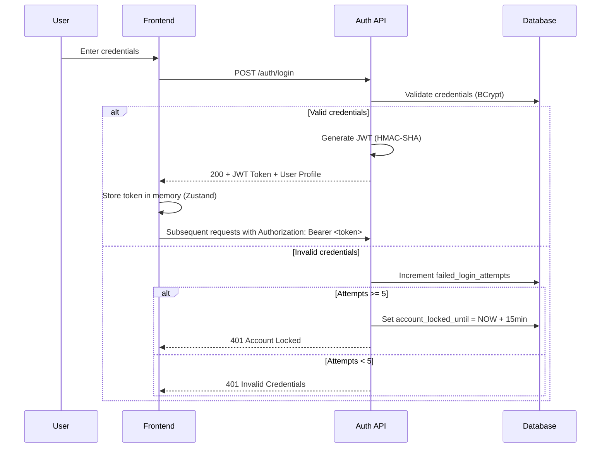
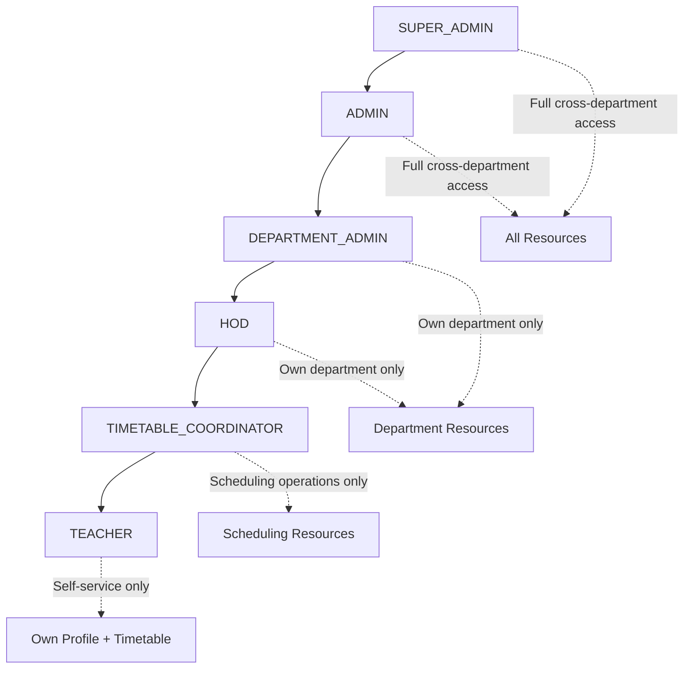
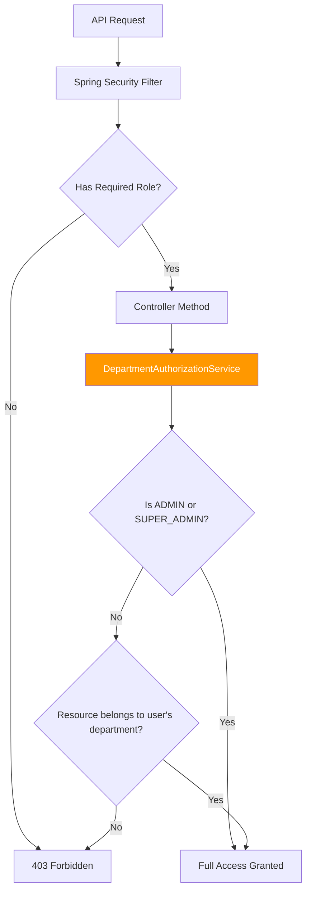

# Security Architecture

> [!IMPORTANT]
> This document describes the security architecture of SamaySetu at a conceptual level. Implementation details, cryptographic configurations, and security-critical source code are maintained in the private production repository.

---

## Authentication System

### JWT-Based Stateless Authentication

SamaySetu uses a fully stateless authentication model powered by JSON Web Tokens (JWT). No server-side sessions are stored — all authentication state is carried in the token itself.



### Token Lifecycle
- **Issuance:** On successful login, a JWT is generated containing the user's email, role, and department ID
- **Validation:** Every API request passes through the `JWTRequestFilter` which extracts and validates the token
- **Expiration:** Tokens have a configurable TTL; expired tokens are rejected at the filter level
- **Refresh:** Frontend automatically handles token refresh via Axios interceptors

---

## Authorization Model

### 6 Granular Roles



| Role | Scope | Capabilities |
|------|-------|-------------|
| `SUPER_ADMIN` | Institution-wide | Full CRUD on all resources, all departments, user management |
| `ADMIN` | Institution-wide | Full CRUD on all resources, all departments |
| `DEPARTMENT_ADMIN` | Department-scoped | Manage own department's courses, divisions, teachers, rooms |
| `HOD` | Department-scoped | Same as DEPARTMENT_ADMIN + faculty approval/rejection |
| `TIMETABLE_COORDINATOR` | Department-scoped | Timetable building, time slot management, resource scheduling |
| `TEACHER` | Self only | View own timetable, set availability, manage profile |

### Department-Scoped Authorization

Unlike simple role-based access, SamaySetu enforces **resource-level ownership checks** at the service layer:



**Resources checked:**
- Divisions → verified against department ownership
- Courses → verified against department ownership
- Teachers → verified against department membership
- Rooms → verified against department assignment (if department-specific)
- Timetable entries → verified through division → department chain

---

## Security Layers

### Layer 1: Rate Limiting (Redis-Backed)

```
Request → RateLimitFilter → JWT Filter → Controller
           ↓ (if exceeded)
         429 Too Many Requests
```

- **Implementation:** Redis-backed sliding window counters per IP address
- **Tiered limits:** Different thresholds for authentication vs. API endpoints
- **Purpose:** Protects against brute-force login attacks and API abuse

### Layer 2: JWT Validation

```
Request → Extract Bearer token → Validate signature → Extract claims → Load user
           ↓ (if invalid)            ↓ (if expired)
         401 Auth Required         401 Auth Required
```

### Layer 3: Spring Security URL Rules

```
/auth/**                    → Public (no auth required)
/api/academic-years/**      → Any authenticated user
/api/time-slots/**          → Any authenticated user
/api/timetable/**           → Authenticated + method-level @PreAuthorize
/api/faculty/**             → TEACHER + all admin roles
/api/staff/**               → Any authenticated user (self-service)
/admin/**                   → Admin roles only (ADMIN, HOD, COORDINATOR, etc.)
```

### Layer 4: Method-Level Authorization

```java
@PreAuthorize("hasAnyRole('ADMIN', 'SUPER_ADMIN', 'DEPARTMENT_ADMIN', 'HOD')")
// Applied per controller method for fine-grained control
```

### Layer 5: Department Authorization Service

```
Service method → DepartmentAuthorizationService.checkDivisionAccess(id)
                  → Loads resource → Compares department → Allow or 403
```

---

## HTTP Security Headers

| Header | Configuration | Purpose |
|--------|--------------|---------|
| `Strict-Transport-Security` | `max-age=31536000; includeSubDomains` | Force HTTPS for 1 year |
| `X-Frame-Options` | `DENY` | Prevent clickjacking |
| `X-Content-Type-Options` | `nosniff` | Prevent MIME-type sniffing |
| `Cache-Control` | `no-cache, no-store` | Prevent caching of API responses |
| `Content-Security-Policy` | `default-src 'self'; frame-ancestors 'none'` | Restrict resource loading |

---

## Input Validation & Sanitization

### Global XSS Prevention

A `@RestControllerAdvice` interceptor automatically sanitizes all incoming request body strings:

```
Incoming JSON → InputSanitizationAdvice → Strip HTML tags → Controller
```

- Applied globally to all REST controllers
- Strips HTML tags and script injections from string fields
- Works in conjunction with Spring's `@Valid` annotation for bean validation

### Bean Validation

All DTOs use Jakarta Bean Validation annotations:
- `@NotBlank`, `@NotNull` — required fields
- `@Email` — email format validation
- `@Size` — string length constraints
- `@Min`, `@Max` — numeric range validation

---

## Account Security Features

| Feature | Implementation |
|---------|---------------|
| **Password Hashing** | BCrypt with default rounds |
| **Account Lockout** | 5 failed attempts → 15-minute automatic lock |
| **First-Login Password Change** | Forced change for admin-created accounts |
| **Email Verification** | Token-based verification for self-registration |
| **Password Reset** | Time-limited token sent via email |
| **CSRF Protection** | Disabled (appropriate for stateless JWT APIs) |
| **CORS** | Configurable allowed origins via `app.cors.allowed-origins` |

---

## Audit Trail

Administrative actions are logged with structured audit entries:

```
[AUDIT] action=CREATE_STAFF | actor=admin@college.edu | target=teacher@college.edu | timestamp=2026-01-15T10:30:00
[AUDIT] action=PUBLISH_TIMETABLE | actor=coordinator@college.edu | division=CS-A | semester=SEM_3
[AUDIT] action=APPROVE_TEACHER | actor=hod@college.edu | target=newteacher@college.edu
```

- Logged at `INFO` level for persistence in log aggregation systems
- Captures actor identity, action type, target resource, and timestamp
- Supports compliance and incident investigation requirements
